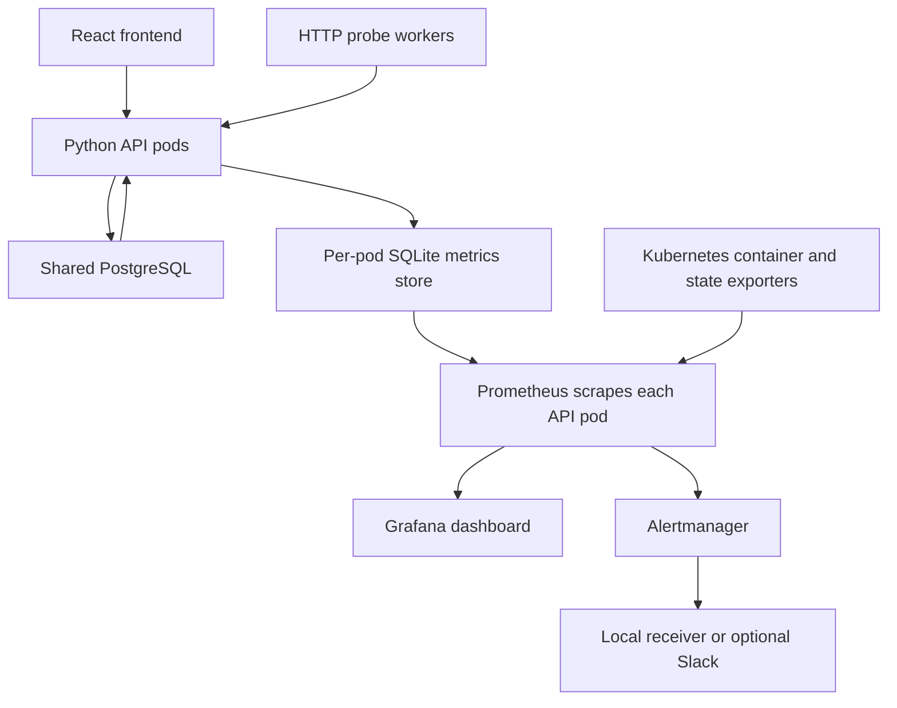

# Architecture and scope

Local Compose uses one API container with two Gunicorn processes and four threads per process. EKS retains Project 1's API Deployment replica count. ServiceMonitor discovers individual pod endpoints through a dedicated ClusterIP Service; it does not scrape one load-balanced virtual IP and accidentally mix counter streams. Each pod's two Gunicorn workers update the same local SQLite WAL store with atomic transactions. `observability/start.py` removes the previous metrics database before launching Gunicorn so a new container starts with fresh counters. Prometheus `rate()` handles counter resets; do not compare raw counts across restarts.

The exporter deliberately uses only Python's standard library so real thread/process behavior can be checked offline. SQLite writes serialize, can add up to a one-second busy wait, and are unsuitable for claiming high-throughput production capacity. The request timing histogram excludes the telemetry write itself. Failed telemetry commits log `request_telemetry_dropped` and permit the API response; this creates undercounting. A production evolution should benchmark telemetry overhead and use a mature multi-process client or collector. This project does not claim exact error budgets or an SLO implementation.

Probe observations live in the application PostgreSQL database, not the local metrics store. They are exported by every API replica. Use `max by (namespace,target)` to deduplicate shared health/timestamps. These are HTTP health probes; they do not measure network throughput, packet loss, or ALB request duration. Export is capped at twenty targets and signals truncation. Project 1's normal two named targets remain below the cap. Database collection failure removes the probe gauges and exposes an explicit failure gauge rather than reporting false health.

The namespace and job labels are scrape-time labels. Local static scrape configuration supplies the same `namespace="netops"`, `job="netops-api"` labels that Kubernetes discovery produces. Routes and methods are bounded; arbitrary paths become `__other__`, unknown methods become `OTHER`, and responses use status classes. Request IDs, tokens, URLs, and query strings are never metric labels. The API's `/metrics` endpoint is unauthenticated for internal scraping and must remain private. Monitoring Services are ClusterIP; local UI ports bind to loopback. Cluster administrators can still access metrics and Secrets.

kube-prometheus-stack provides the Operator, Prometheus, Alertmanager, Grafana, node exporter, kube-state-metrics, and kubelet/cAdvisor collection. Managed EKS control plane endpoints such as etcd/controller-manager/scheduler are disabled in our values. Chart versions may change names or behavior: pin and render your selected version first. Installation assumes existing cluster RBAC privileges and available worker capacity.

This is single-instance lab monitoring. Default EKS history is ephemeral with six-hour retention; pod recreation can erase it. Optional EBS persistence retains history, incurs storage charges, and is not a backup or HA strategy. Slack failure does not repair an incident; no automated remediation is implemented. The sink holds only the latest 100 events in RAM. Use runbooks to show detection, diagnosis, recovery, and confirmation.
